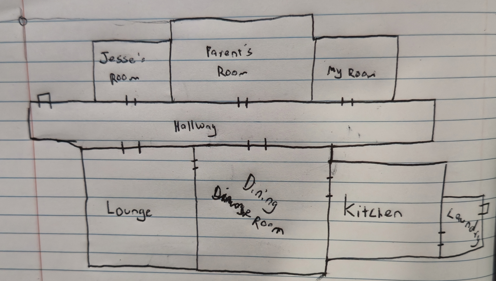

# (Don't) Steal the Cookie

## Description
(Don't) Steal the Cookie is a **Puzzle / Stealth Game** about doing something we have probably all tried at some point.

It's the school holidays and your mum has baked some cookies.  
She warned you not to take one but they smell so good!

What lengths will you go to get one of those delicious cookies.

**Controls**  
- WASD: Movement  
- E: Interact  
- Touch Screen support
- Gamepad Support

Top Down Perspective
3d 
PC / Web / Mobile

## Development Issues / Todo List

- Player movement  Touch / Keyboard / Gamepad 
- Object Interaction (eg. Move Stool)
- Item Interaction (eg. Take Cookie)
- Door Lock and Key 

- Objectives UI and Diologue
- Hide Interaction 
- Room Navigation (Fog of War)

- Pathfinder

- Main Menu
- Settings 
- Pause
- Menu Navigation Touch / Keyboard / Gamepad 
- Menu Icons (Keyboard / Gamepad)

- Custom Choice Character Name
- Custom Choice Character Appearance
- Speech Boxes
- Assets

---

## Game Breakdown

### Demo Section
- Start in the Living Room
- Mum comes in to tell you "Don't Steal the Cookie"
- New Goal Acquired: **"Steal the Cookie"** 
- Enter Dining Room
- Enter Kitchen
- Steal Cookie Attempt 1 (**fail**)
- New Sub Goal: **"Find a way to reach the cookies"** (Stool is Glowing)
- Move stool
- Steal Cookie Attempt 2 (**success**)
- Caught red handed

### Section 1
- Grounded to your room
- New Goal: **"Get to the Kitchen"**
- Enter hallway
- Mum is seen entering another room
- Enter the Dining Room (**door locked**)
- New Sub Goal: **"Find the Key"**
- Enter Bathroom (**door locked**) → Say *"I think someone's in there"*
- Enter Lounge (**stop**) → Say *"Mum just went in there, I need to be careful"*
- Enter Parents Room
- Find Key
- Enter Hallway 
- Enter Dining Room (**Door Opens**)
- Enter Kitchen
- "Stool is Gone"
- Finds Step Ladder in Laundry
- Cookie Acquired

### Section 2
- Mum says **"PLAYER NAME!!!!"**
- New Goal: **"Hide"**
- Mum Pathfinder switches to Patrol mode

**Scenarios:**
- Player hides → Mum enters, loops around the kitchen, then leaves
- Player fails to hide → Mum enters, finds player → Section resets
- New Goal: **"Get back to your room"**
- Enter Dining Room
- Mum finishes loop and enters Lounge
- Enter Hallway (**Door Locked**)
- Enters Lounge
- Mum does a slower loop around the room
- Enter Hallway
- Mum enters Hallway
- Enters Bedroom
- **Level Completed**

---

## Mum Pathfinder States

### Neutral
- Pre-programmed movement
- Unaware of surroundings
- For story purposes
- Does not transition to or from this state naturally

### Patrol
- Navigates around a selected room

### Found
- Moves towards the player with increased speed
- If player leaves line of sight and hides → transitions back to **Patrol** mode

---

## Camera & Visibility
- Static camera above Player
- Player rotates to face walking direction

## Player Customization
- Custom Choice Character Name
- Custom Choice Character Appearance

## Layout Concept

